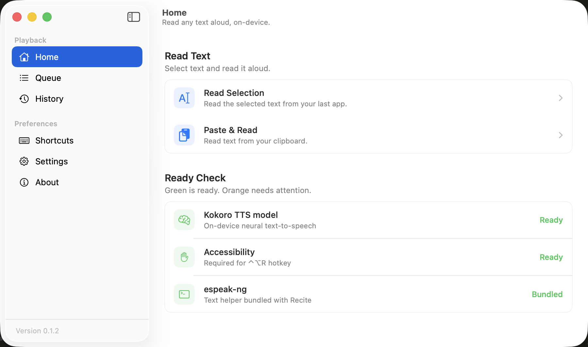

# Recite

[](https://github.com/r3dbars/recite/actions/workflows/build.yml)
[](https://github.com/r3dbars/recite/releases/latest)
[](LICENSE)


Select text in any app, press **Control + Option + R**, and Recite reads it aloud on your Mac. Local AI voices. No cloud voice API. No per-minute bill. No sending your reading material to a server.

**[Download the latest DMG](https://github.com/r3dbars/recite/releases/latest)**



## Why Recite

- Read articles, docs, emails, and notes while you do something else.
- Keep selected text and generated audio on your Mac.
- Queue text, replay history, pick a voice, and change speed.
- Start from a global hotkey or the menu bar.

## How It Works

1. You select text.
2. Recite grabs that selected text.
3. A local MLX voice model turns the text into audio.
4. Your Mac plays it back.

Recite defaults to [Kokoro-82M-bf16](https://huggingface.co/mlx-community/Kokoro-82M-bf16). Settings can switch to Qwen3-TTS or Chatterbox Turbo. Kokoro ships 13 English voice presets (Heart is the default), plus bundled samples for the other models.

## Privacy

- Selected text stays on your Mac. Recite does not send it, or the generated audio, to a server.
- The copy fallback restores your clipboard after it runs.
- Reading history is stored locally in macOS user defaults and can be cleared in the app.
- The selected voice model downloads once from Hugging Face.

See [SECURITY.md](SECURITY.md) to report a vulnerability privately. Do not open a public security issue.

## Requirements

- macOS 14 Sonoma or newer
- Apple Silicon Mac
- No Homebrew install is needed for the DMG download.

## Quick Start

From source:

```bash
git clone https://github.com/r3dbars/recite.git
cd recite
brew install espeak-ng
swift build
./scripts/build-and-run.sh
```

See [SETUP.md](SETUP.md) for permissions, first launch, DMG builds, and troubleshooting.

On first launch, Recite downloads the selected voice model from Hugging Face. After that, reading runs locally.

## Use Recite

1. Launch Recite.
2. Grant Accessibility permission when macOS asks.
3. Select text in another app.
4. Press **Control + Option + R**.

The menu bar icon can also read clipboard text, open the window, pause playback, or manage the queue.

## Build A Local DMG

```bash
./scripts/build-dmg.sh
```

This builds a **release** app and writes `.build/dist/Recite-<version>.dmg`. Local builds use ad-hoc signing by default. To use a local signing identity:

```bash
RECITE_CODESIGN_IDENTITY="Apple Development: Your Name (TEAMID)" ./scripts/build-dmg.sh
```

## Project Map

```text
Package.swift                         Swift Package entry point
scripts/build-and-run.sh              Build, sign, and launch Recite.app
scripts/build-dmg.sh                  Build a release DMG
Recite/Sources/Recite/AppDelegate.swift
                                      Menu bar, hotkey, and app lifecycle
Recite/Sources/Recite/TextGrabber.swift
                                      Selected text capture
Recite/Sources/Recite/SpeechEngine.swift
                                      MLX engine core, plus ModelLoading/VoicePreview/Generation/Playback
Recite/Sources/Recite/Speech/         Text preprocessing
Recite/Sources/Recite/Models/         Voice and model catalogs
Recite/Sources/Recite/ReadingQueue.swift
                                      Queue and local history
Recite/Sources/Recite/UI/             SwiftUI popover, window, and settings
Recite/Resources/                     App metadata, entitlements, and icons
Tests/ReciteTests/                    Text, voice catalog, and queue tests
docs/assets/                          README art and generated icon source
```

## Development

See [SETUP.md](SETUP.md) for setup details.

See [CONTRIBUTING.md](CONTRIBUTING.md) before opening a pull request.

See [SECURITY.md](SECURITY.md) for private vulnerability reporting.

## License

Recite source code is MIT licensed.

Release builds also include or download third-party components with their own licenses. See [THIRD_PARTY_NOTICES.md](THIRD_PARTY_NOTICES.md).
